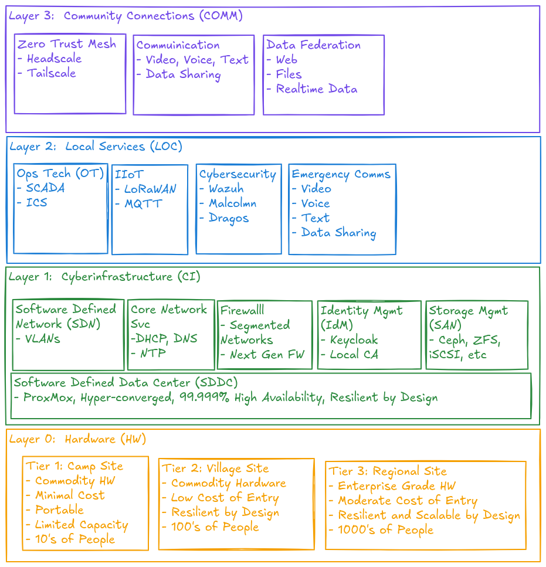

# Clear Skies

A Reference Architecture for Resilient Alaskan Microgrid
Cyberinfrastructure

- [ClearSkies-PDF](build/ClearSkies.pdf)
- [ClearSkies-MD](build/ClearSkies.md)
- [ClearSkies-HTML](build/ClearSkies.html)
### Vision Statement

**Clear Skies** is a locally grown initiative to build
**community-owned, cloud-free digital infrastructure** across rural
Alaskan microgrid communities. It empowers villages, tribes, and
regional utilities to host and secure their own data, communications,
and operational systems — right where they live and work without
reliance on distant cloud services.
 
It strengthens self-reliance, ensures continuity during network outages,
and creates a foundation for innovation that reflects Alaska’s values of
**independence, stewardship**, and **cooperation**.

The following reference architecture outlines how Clear Skies can be
implemented in modular layers, from physical infrastructure to regional
collaboration services.

