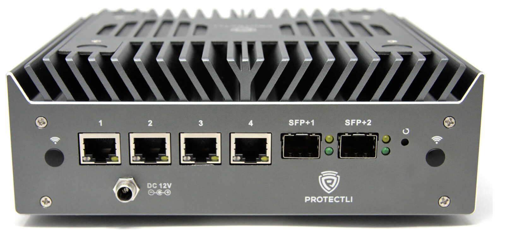
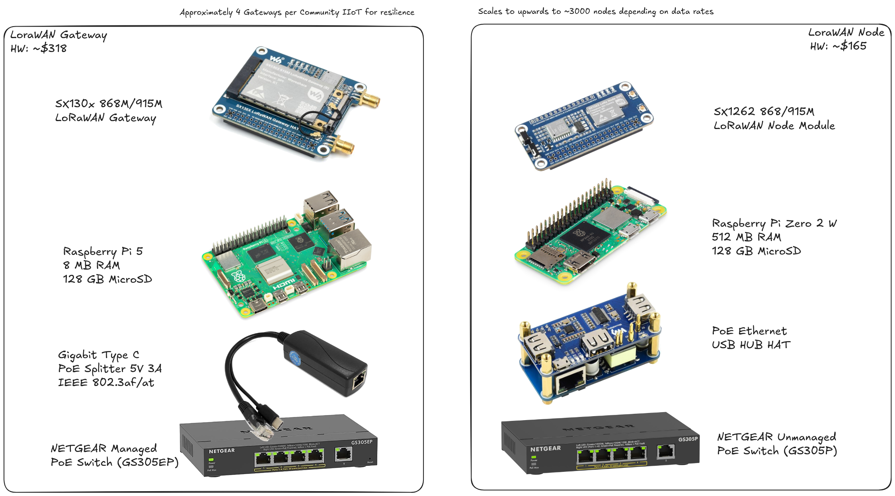
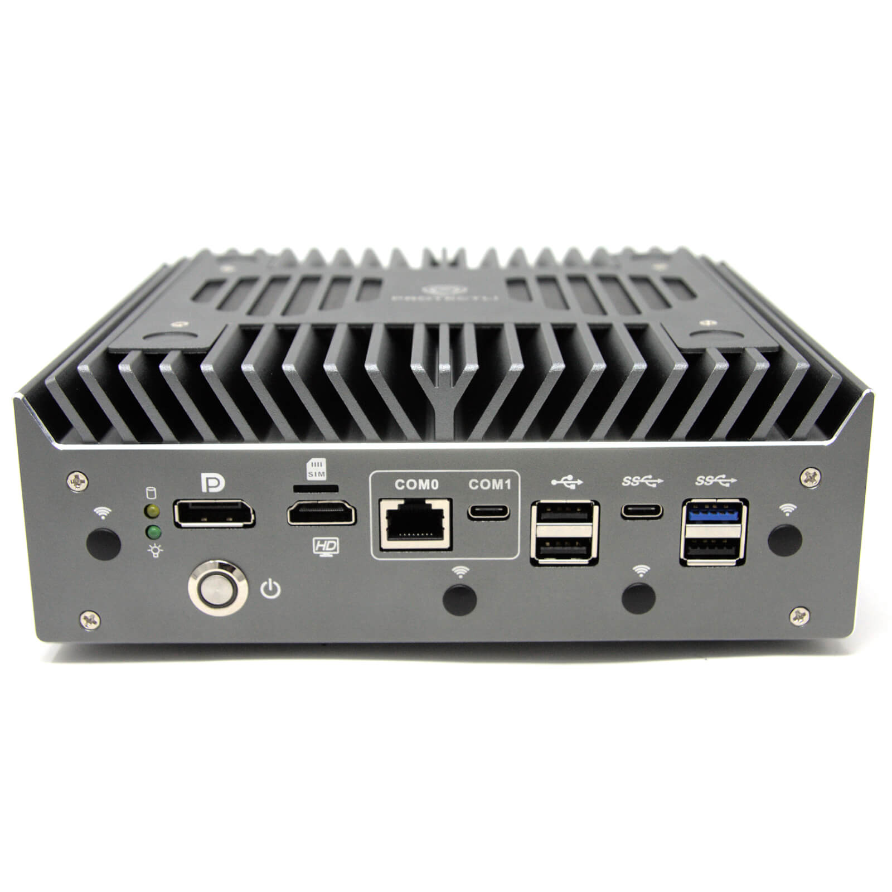
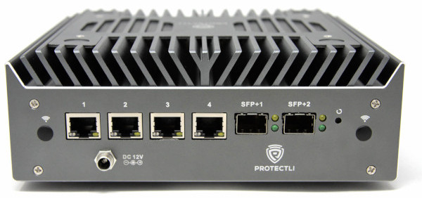
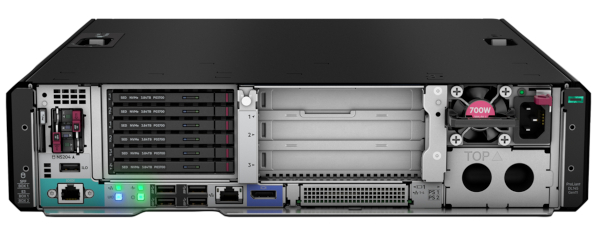
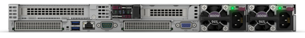
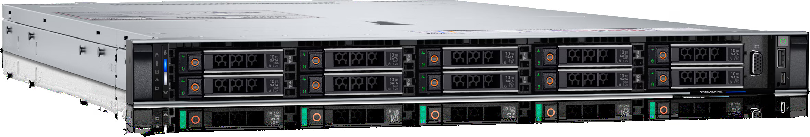

---
bibliography:
- lib/citations.bib
link-citations: true
title: Clear Skies - A Reference Architecture for Resilient Alaskan
  Microgrid Cyberinfrastructure
title-block: false
---

  <!-- Title Page -->
  <h1 style="margin-top:3em; font-size:2.4em; text-align:center;">Clear Skies</h1>
  <h2 style="text-align:center; font-weight:normal;">A Reference Architecture for Resilient Alaskan Microgrid Cyberinfrastructure</h2>

  

    
  

  

  

  <!-- Metadata Page (PDF analog) -->
  

  <!-- Metadata Page (PDF analog) -->
    <table style="margin-top:5em; width:100%; border-collapse:collapse;">
      <tbody>
        <tr><td style="width:30%; font-weight:bold;">Title</td><td>Clear Skies</td></tr>
        <tr><td style="font-weight:bold;">Subtitle</td><td>A Reference Architecture for Resilient Alaskan Microgrid Cyberinfrastructure</td></tr>
        <tr><td style="font-weight:bold;">Affiliation</td><td>Alaska Center for Energy and Power</td></tr>
        <tr><td style="font-weight:bold;">Institution</td><td>University of Alaska Fairbanks</td></tr>
        <tr><td style="font-weight:bold;">Author</td><td>John Haverlack</td></tr>
        <tr><td style="font-weight:bold;">Copyright</td><td>© 2025 Alaska Center for Energy and Power</td></tr>
        <tr><td style="font-weight:bold;">License</td><td>CC BY-ND 4.0</td></tr>
        <tr><td style="font-weight:bold;">Version</td><td>0.0.3</td></tr>
        <tr><td style="font-weight:bold;">Date</td><td>2025-11-13</td></tr>
        <tr><td style="font-weight:bold;">State</td><td>PRE-DRAFT</td></tr>
        <tr><td style="font-weight:bold;">Source</td><td>https://github.com/acep-uaf/acep-clear-skies</td></tr>
      </tbody>
    </table>
  

  

-   [Executive Summary](#executive-summary)
-   [Introduction](#introduction)
    -   [Vision Statement](#vision-statement)
    -   [Problem Statement](#problem-statement)
-   [Strategic Architecture](#strategic-architecture)
    -   [Layer 0 - Hardware (HW)](#layer-0---hardware-hw)
        -   [Tier 1 - Camp Site](#tier-1---camp-site)
        -   [Tier 2 - Village Site](#tier-2---village-site)
        -   [Tier 3 - Regional Site](#tier-3---regional-site)
    -   [Layer 1 - Cyberinfrastructure
        (CI)](#layer-1---cyberinfrastructure-ci)
        -   [Networking & Segmentation](#networking-segmentation)
        -   [Identity & Trust](#identity-trust)
        -   [Storage & Resiliency](#storage-resiliency)
        -   [Monitoring & Automation](#monitoring-automation)
        -   [Security & Perimeter](#security-perimeter)
        -   [Data Backup &
            Synchronization](#data-backup-synchronization)
    -   [Layer 2 - Local Services (LOC)](#layer-2---local-services-loc)
        -   [Operational Technology (OT) / SCADA /
            ICS](#operational-technology-ot-scada-ics)
        -   [Emergency Communications](#emergency-communications)
        -   [Local Community
            Communications](#local-community-communications)
        -   [Additional Service Categories
            (Expandable)](#additional-service-categories-expandable)
        -   [Outcome](#outcome)
    -   [Layer 3 - Community Connections
        (COMM)](#layer-3---community-connections-comm)
        -   [Collaborative Applications](#collaborative-applications)
        -   [Outcome](#outcome-1)
-   [Technology Selection](#technology-selection)
    -   [Layer 0 — Hardware Foundations](#layer-0-hardware-foundations)
        -   [Tier 1 — Camp Site](#tier-1-camp-site)
        -   [Tier 2 — Village Site](#tier-2-village-site)
        -   [Tier 3 — Regional Site](#tier-3-regional-site)
    -   [Layer 1 — Cyberinfrastructure
        (CI)](#layer-1-cyberinfrastructure-ci)
    -   [Layer 2 — Local Services](#layer-2-local-services)
        -   [Industrial Internet of Thing
            (IIoT)](#industrial-internet-of-thing-iiot)
    -   [Layer 3 — Community
        Connections](#layer-3-community-connections)
-   [Hardware Specifications](#hardware-specifications)
    -   [SDDC Servers](#sddc-servers)
        -   [Proxmox VE Server Hardware
            Requirements](#proxmox-ve-server-hardware-requirements)
    -   [Server Comparison](#server-comparison)
    -   [Server Specifications](#server-specifications)
        -   [Qotom Q30900GE S13 Series](#qotom-q30900ge-s13-series)
        -   [MINIS FORUM MS-A2](#minis-forum-ms-a2)
        -   [Protectli VP6630](#protectli-vp6630)
        -   [Protectli VP6650](#protectli-vp6650)
        -   [MINIS FORUM MS-S1 Max](#minis-forum-ms-s1-max)
        -   [Lancelot 1199-SR](#lancelot-1199-sr)
        -   [ProLiant DL145 Gen11](#proliant-dl145-gen11)
        -   [Lancelot 1898-N12](#lancelot-1898-n12)
        -   [ProLiant DL325 Gen11](#proliant-dl325-gen11)
        -   [PowerEdge R6615](#poweredge-r6615)
-   [Terminology](#terminology)
-   [Citations](#citations)

# Executive Summary

Alaska has the world’s highest concentration of islanded
microgrids—small, self-contained power systems that sustain hundreds of
remote communities unconnected to any central grid. These systems are
lifelines, but they face growing challenges: rising fuel and logistics
costs, access to technical talent, fragile Internet connectivity, and
increasing exposure to cyber threats as digital controls expand into
every corner of local infrastructure.

**Clear Skies** proposes a new path forward — a *local-first, Internet
independent cyberinfrastructure reference architecture* designed
specifically with resiliency and security in mind for Alaska’s rural
communities. By establishing scalable, community-owned data and control
systems, Clear Skies enables essential digital services—SCADA,
communications, cybersecurity, and data management—to operate
**independently of Internet access**.

The Clear Skies reference architecture defines a layered and modular
approach to resilience:

-   **Layer 0 – Hardware Foundations:** three tiers of scalable
    deployment (Camp, Village, Regional) that balance cost, capacity,
    and redundancy using commodity or enterprise hardware.
-   **Layer 1 – Cyberinfrastructure (CI):** a local Software-Defined
    Data Center (SDDC) providing virtualization, networking, storage,
    and identity services built on open-source tools such as Proxmox,
    Ceph, and OPNsense.
-   **Layer 2 – Local Services:** modular applications for operational
    technology (OT), industrial IoT, emergency communications, and
    community collaboration—entirely hosted and managed within the local
    network.
-   **Layer 3 – Community Connections:** secure, zero-trust bridges that
    enable inter-village collaboration, cross-site data sharing, and
    regional coordination while preserving digital sovereignty.

Clear Skies is more than an IT architecture—it is an **enabler of
digital sovereignty**, extending the principles of local
self-determination into the digital domain.  
Its modular design allows each community to start small, learn, and
grow—building capacity, reducing dependency, and cultivating a workforce
skilled in managing their own resilient, secure digital infrastructure.

The Clear Skies reference architecture strategically supports diverse
use cases—Home Labs, Test Beds, Training Grounds, On-site CI, Community
CI, Emergency Communications, and Industrial CI—providing a roadmap for
communities not just to *keep the lights on*, but to illuminate their
own path toward independence, innovation, and long-term sustainability
in the digital era.

# Introduction

### Vision Statement

**Clear Skies** is a locally grown initiative to build
**community-owned, cloud-free digital infrastructure** across rural
Alaskan microgrid communities. It empowers villages, tribes, and
regional utilities to host and secure their own data, communications,
and operational systems — right where they live and work without
reliance on distant cloud services.

By bringing computing power, cybersecurity, and communications back
under local control, **Clear Skies** advances *digital sovereignty* as
as a modern expression of community and tribal self-determination.  
It strengthens self-reliance, ensures continuity during network outages,
and creates a foundation for innovation that reflects Alaska’s values of
**independence, stewardship**, and **cooperation**.

The following reference architecture outlines how Clear Skies can be
implemented in scalable layers, from physical infrastructure to regional
collaboration.

## Problem Statement

Alaska has the worlds highest concentration of island-ed micro-grids in
the world. The remote communities are not connected by roads or
transmission lines. Most generate power primarily with diesel, and the
fuel is expensive, especially if the community is not on a the coast or
river systems where fuel can be barged in. For those remote communities
fuel must be flown in.

Internet access in these communities is also a constrained resource.
Some coastal communities have access to high speed fiber optic
connections, while others have been limited to expensive geosynchronous
satellite communications. Though in 2 of the last 3 years, sea ice has
cut burred cables resulting several month service outages. Low earth
orbit (LEO)([“Low Earth Orbit” 2025](#ref-LowEarthOrbit2025)) satellite
systems have be come available in recent years, however also carries the
unaddressed risk of Kessler syndrome([“Kessler Syndrome”
2025](#ref-KesslerSyndrome2025)), where a cascading collision of
satellites starts a chain reaction leaving the entire LEO orbital space
unusable for potentially centuries.

Rural Alaskan micro-grid communities range between less than a hundred
to over 3000 people. The energy utilities in these communities are
commonly operated by a handful of individuals. Staffing rural utilities
is a challenging balance between keeping energy costs low and attracting
skilled workers.

For much of the United States, the Federal Energy Regulatory Commission
(FERC)([“Home Page Federal Energy Regulatory Commission”
n.d.](#ref-HomePageFederal)) is the regulator agency that governs energy
utilities in the U.S.   FERC mandates that energy utilities in the
United States to follow the North American Electric Reliability
Corporation (NERC)([“NERC” n.d.](#ref-NERC)) Critical Infrastructure
Protection (CIP)([“Reliability Standards”
n.d.](#ref-ReliabilityStandards)) standards in regards to cybersecurity
compliance for energy utilities Operational Technology networks. However
compliance criteria are based largely on transmission capabilities.
Because no utility in Alaska is connected to the lower 48 power grid,
Alaska utilities have been effectively exempt from cybersecurity
regulation. Recently the Railbelt Reliability Council (RRC)([“Alaska
Railbelt Reliability Council” 2025](#ref-AlaskaRailbeltReliability2025))
has drafted a set of modified CIP standards([“(CIP) Critical
Infrastructure Protection” 2025](#ref-CIPCriticalInfrastructure2025))
for the State of Alaska which are based on the NERC CIP standards but
tuned to accommodate Alaskan specific criteria. Once adopted by the
Regulatory Commission of Alaska (RCA)([“Regulatory Commission of Alaska”
n.d.](#ref-RegulatoryCommissionAlaska)) the RRC CIP standards are
expected to become a regulator compliance requirement for those Alaskan
power producer connected to the Railbelt energy grid.

While the RRC CIP standards address the comprehensive scope of risks for
critical energy infrastructure, rural islanded Alaskan microgrids will
remain largely exempt from compliance because they do not meet the
transmission criteria. Additionally meeting cybersecurity standards
would represent a significant cost to rural communities already
struggling with the cost of energy. Not only would these communities
need to pay for expensive cybersecurity expertise, but would likely mean
expensive upgrades to existing network equipment.

# Strategic Architecture

Clear Skies is built on a simple principle: **local-first by design.**  
Every system — from the smallest sensor to the community data center —
operates independently of the cloud services, ensuring that essential
services remain available, secure, and under local control even when
Internet connectivity is lost.

Clear Skies adopts a layered approach to build increasingly complex
modular capabilities on top of a resilient cyberinfrastructure
foundation.

## Layer 0 - Hardware (HW)

The hardware selection can be based on 3 tiers to accommodate different
cost, scalability, and resiliency needs.

### Tier 1 - Camp Site

**Purpose:** Portable or training-scale deployments for small teams and
pilot projects.

-   Commodity Grade Hardware
-   Low Cost of Entry and Maintenance
-   Portability
-   Limited Capacity
-   Basic Services
-   Limited Resiliency
-   Scales to 10’s of People

### Tier 2 - Village Site

**Purpose:** Fully featured, community-level cyberinfrastructure
supporting daily operations.

-   Commodity Grade Hardware
-   Low Cost of Entry and Maintenance
-   Full Stack Service Capabilities
-   Full Resiliency - Zero Single Points of Failure
-   Scales to 100’s of People

### Tier 3 - Regional Site

**Purpose:** High-capacity, multi-community or research hub supporting
advanced services and federation.

-   Enterprise Grade Hardware
-   Moderate Cost of Entry and Maintenance
-   Full Resiliency - Zero Single Points of Failure
-   Scales to 1000’s of People

## Layer 1 - Cyberinfrastructure (CI)

The Cyberinfrastructure (CI) Layer forms the digital powerhouse of a
Clear Skies deployment.  
It establishes the **core network and compute services** that allow
every community site — from Camp Site to Regional Site — to operate
independently of outside cloud resources.

The CI Layer is implemented as a **Software-Defined Data Center
(SDDC)**([“Software-Defined Data Center”
2025](#ref-SoftwaredefinedDataCenter2025)): a cluster of virtualized
servers that pool compute, storage, and networking into one resilient
platform.  
This approach provides enterprise-grade reliability using open-source
tools and commodity hardware, enabling small teams to manage complex
infrastructure with minimal overhead.

### Networking & Segmentation

-   VLAN-aware switching and software-defined routing using **OPNsense**
    or similar open firewalls.
-   Segregated networks for Management, Operational Technology (OT),
    Data, and DMZ zones.
-   Local DNS, DHCP, and NTP ensuring that critical systems function
    offline.

### Identity & Trust

-   **Keycloak** provides single sign-on and multi-factor
    authentication.
-   **Smallstep CA** or similar certificate authority issues short-lived
    internal certificates, enabling encrypted, trusted communication
    between devices and services.

### Storage & Resiliency

-   **Ceph** or **ZFS-based** distributed storage replicates data across
    all nodes.
-   Snapshots and versioned backups protect against corruption or
    accidental deletion.  
-   Air-gap or offline backup options for disaster recovery.

### Monitoring & Automation

-   **Prometheus + Grafana** for metrics, alerting, and visibility.
-   **Ansible** or **Chef** for configuration management and repeatable
    deployments.
-   Logs aggregated locally via **Elastic / Wazuh / Loki** stacks.

### Security & Perimeter

-   Dual-node firewall pairs provide high-availability failover.
-   Intrusion detection (Zeek/Suricata) can run as virtual appliances
    inside the same SDDC.
-   Role-based access control and network segmentation enforce the
    “least privilege” model.

### Data Backup & Synchronization

-   Automated local backups using **Restic**, **Borg**, or similar tools
-   Optional cross-site replication between Village and Regional Sites
    when connectivity permits.  
-   All data remains encrypted and community-owned.

## Layer 2 - Local Services (LOC)

Layer 2 builds upon the Cyberinfrastructure (CI) foundation to deliver
the mission-specific functions that keep a community operating,
informed, and connected. These following modular service areas are
locally hosted—able to run entirely within the community network—and can
be added, removed, or upgraded without disrupting the lower layers.

Each category reflects a practical application of the local-first
philosophy: keeping critical data, control, and communication inside the
community while remaining interoperable with regional and research
partners.

### Operational Technology (OT) / SCADA / ICS

**Purpose:** maintain safe, efficient, and observable microgrid
operations under all conditions.

-   Supervisory control and monitoring for generation, distribution, and
    storage systems.
-   Secure, segmented access for operators, engineers, and vendors.
-   Local data historians for real-time visibility even during WAN
    outages.
-   Integration with open-source or vendor SCADA platforms (e.g., Rapid
    SCADA, Ignition Edge, OpenPLC).

#### Industrial Internet of Things (IIoT) Networks

**Purpose:** gather and use data from across the community—power, heat,
water, environment—to inform decisions locally.

-   LoRaWAN, Modbus TCP, and MQTT telemetry from sensors across the
    community.
-   Local brokers and dashboards (Node-RED, Grafana) for low-bandwidth
    visualization.
-   Edge analytics and rule-based automation without cloud dependence.

### Emergency Communications

**Purpose:** ensure situational awareness and coordination during
disasters or outages.

-   Local voice, text, and alerting systems that function when
    commercial networks fail.
-   Interoperable with radios, satellite links, or FirstNet gateways
    when available.
-   Capable of community-wide paging, siren control, or automated
    messaging through existing IoT endpoints.

### Local Community Communications

**Purpose:** strengthen community cohesion and digital inclusion through
local, private communication spaces.

-   Locally hosted chat, video, and bulletin-board tools (Matrix, Jitsi,
    etc).
-   Intranet portals for schools, clinics, and tribal councils.
-   Content caching and offline web access for education and information
    sharing.

### Additional Service Categories (Expandable)

-   **Cybersecurity Operations:** IDS/IPS, log correlation,
    vulnerability scanning, and SOC visualization.
-   **Education & Research Sandboxes:** student training, network
    simulation, or data-science environments.
-   **Local Data Services:** GIS, asset management, or archival storage
    tied to community projects.

### Outcome

Layer 2 turns Clear Skies from infrastructure into impact — providing
the tools that make a self-reliant community not only operationally
resilient but also informed, connected, and empowered.

## Layer 3 - Community Connections (COMM)

Layer 3 extends Clear Skies beyond individual communities.  
It enables **secure collaboration, knowledge sharing, and regional
coordination** between sites — while preserving each community’s digital
sovereignty.  
These connections are intentional, encrypted, and always under local
control. \### Secure Networking and Federation - **Tailscale / Headscale
Zero-Trust Network Access (ZTNA) Bridges:** lightweight, encrypted
overlays that connect Camp, Village, and Regional sites into a trusted
mesh without public exposure. - **Cross-Site Data Sharing:** optional,
policy-driven replication of telemetry, research, and analytics data
between communities or partner institutions. - **Federated Identity and
Trust:** local identity systems (Keycloak / Smallstep CA) exchange only
the credentials necessary for inter-site collaboration. -
**Bandwidth-Aware Synchronization:** asynchronous, store-and-forward
file and database replication designed for limited or intermittent
connectivity.

### Collaborative Applications

-   Shared monitoring dashboards and situational-awareness maps.
-   Federated educational resources and research datasets.
-   Inter-community communication tools for regional operations centers
    or cooperative utilities.

**Purpose:** build a network of sovereign digital islands — each
self-reliant, yet capable of cooperating across Alaska’s vast geography
through secure, transparent, and low-bandwidth bridges.

### Outcome

Layer 3 transforms Clear Skies from isolated local systems into a
**distributed ecosystem of collaboration**.  
Communities retain full control of their data and infrastructure while
participating in a resilient, Alaska-wide digital commons built on
trust, openness, and shared stewardship.

# Technology Selection

*Design and Implementation Blueprint for the Clear Skies Architecture*

This section details the specific technologies, configurations, and
open-source components recommended for each layer and tier of the Clear
Skies architecture.  
Selections emphasize **resilience**, **local autonomy**, and **open
interoperability** across all deployment scales.

## Layer 0 — Hardware Foundations

All 3 tiers of hardware deployment can be built in a shipable rack mount
container for easy setup and portability if desired.

### Tier 1 — Camp Site

*Portable / Training-Scale Deployment*

-   Example hardware platforms (NUC, MiniPC, low-power servers)
-   Typical storage configuration (ZFS mirror, 1 GbE)
-   Lightweight Proxmox or single-node SDDC
-   Local UPS / Power considerations

### Tier 2 — Village Site

*Community-Scale Deployment*

-   Cluster of 3 × MiniPC/Protectli-class nodes
-   Ceph or ZFS-replicated storage
-   Dual OPNsense firewall HA pair
-   Local PoE switch with VLAN segmentation
-   External backup (USB or second site)

### Tier 3 — Regional Site

*Federated Multi-Community Hub*

-   Enterprise-grade rackmount servers (ECC RAM, redundant PSU)
-   10 GbE backplane networking
-   Dedicated Ceph cluster
-   Multi-site replication and Tailscale/Headscale federation

## Layer 1 — Cyberinfrastructure (CI)

-   Virtualization Platform: **Proxmox VE / KVM**
-   Networking Stack: **OPNsense**, **FRR**, VLAN trunking
-   Storage: **Ceph**, **ZFS**, **Restic/Borg**
-   Identity: **Keycloak**, **Smallstep CA**
-   Monitoring: **Prometheus**, **Grafana**, **Loki**, **Wazuh**
-   Configuration: **Ansible** or **Chef**

## Layer 2 — Local Services

-   OT/SCADA: **Rapid SCADA**, **OpenPLC**, **Ignition Edge**
-   IIoT: **Mosquitto (MQTT)**, **Node-RED**, **Grafana**, **LoRaWAN**
-   Comms: **Matrix (Synapse)**, **Jitsi**, **Rocket.Chat**
-   Cybersecurity: **Zeek**, **Suricata**, **Wazuh**, **Elastic**
-   Education / Research: **JupyterHub**, **Docker / LXC Sandboxes**
-   Data: **PostgreSQL**, **GeoServer**, **Nextcloud**

### Industrial Internet of Thing (IIoT)

## Layer 3 — Community Connections

-   Secure Networking: **Tailscale / Headscale (ZTNA Mesh)**
-   Federation: **Keycloak Federation**, **Smallstep cross-trust**
-   Data Sync: **Syncthing**, **rsync**, **MinIO Gateway**
-   Shared Visualization: **Grafana Federation**, **Kibana Dashboards**
-   Optional: Integration with **FirstNet**, **Starlink**, or
    terrestrial backhaul for redundancy

# Hardware Specifications

**Vendor Agnostic**

As it is a stated goal of the Clear Skies architecture to remain vendor
agnostic the following vendor product highlights are for comparison
purposes only and not recommendations or promotions an any specific
vendor or products.

## SDDC Servers

The following data compared serveral technical and capacity aspects of
potential hardware solutions for a Software Defined Data Center (SDDC)
ProxMox server / PVE node.

### Proxmox VE Server Hardware Requirements

| **Category**            | **Bare Minimum** (Lab/Test)          | **Standalone** (Edge)                   | **Hyperconverged Node** (Cluster)                                 |
|-------------------------|--------------------------------------|-----------------------------------------|-------------------------------------------------------------------|
| **CPU**                 | 1× Dual-Core (Intel/AMD, VT-x/AMD-V) | 1× Quad-Core (i5/i7, Xeon-E, Ryzen 5/7) | 1× 6–12 Core (Xeon-D, Xeon-Silver, Ryzen 9, EPYC)                 |
| **Architecture**        | x86-64                               | x86-64                                  | x86-64 (SR-IOV & AES-NI support recommended)                      |
| **RAM**                 | 8 GB minimum (test only)             | 32–64 GB                                | 64–256 GB (ECC prefered)                                          |
| **Boot / OS Disk**      | 64 GB SATA SSD                       | 128 GB SATA/NVMe SSD                    | 256 GB NVMe SSD (mirrored or ZFS mirror)                          |
| **VM/CT Storage**       | \>\~ 250 GB SSD/HDD                  | \>\~ 1 TB Single SSD/NVMe               | 2+ \>\~2 TB NVMe/SSD                                              |
| **Network Interfaces**  | 2× 1 GbE                             | 3× 1/2.5 GbE (LAN, WAN, Mgmt)           | 4–6× 2.5/10 GbE (Mgmt, Ceph, VM LAN, Public, Storage)             |
| **Out-of-Band Mgmt**    | Optional                             | Optional                                | Recommended (IPMI, iDRAC, Etc)                                    |
| **Power Supply**        | Single PSU                           | Single PSU                              | Recommended Dual hot-swappable PSUs                               |
| **TPM / Secure Boot**   | Optional                             | Recommended                             | Required for Microsoft compliance (TPM 2.0)                       |
| **BIOS / Firmware**     | Legacy or UEFI                       | UEFI (coreboot OK)                      | UEFI                                                              |
| **Cluster / Ceph Role** | N/A                                  | Optional (single node)                  | Full cluster member (Ceph OSD + Monitor)                          |
| **Performance Target**  | Small lab / field site               | Small-scale production workloads        | Continuous 24×7 ops with fault tolerance                          |
| **Approx Power Draw**   | 25–40 W                              | 50–90 W                                 | 80–200 W (depending on drives/NICs)                               |
| **Example Platform**    | Intel NUC, Protectli VP6630          | Minisforum MS-01, Protectli VP6650      | Supermicro E300, Xeon-D, or 3× Proxmox mini-cluster               |
| **Notes**               | Not for production                   | Great for edge compute or small SDDC    | Use 3 nodes + Ceph + replication; no single failure halts cluster |

## Server Comparison

| Product                   | CPU (Make + Cores)            | RAM (GB) | OS Disk                    | VM Disk(s)                                                  | 1–2 Gb NICs | 10 Gb NICs |   Rack (U)   | Power (W max) | Price (USD) |
|:--------------------------|:------------------------------|:--------:|:---------------------------|:------------------------------------------------------------|:-----------:|:----------:|:------------:|:-------------:|:-----------:|
| Qotom Q30900GE S13 Series | Intel 8th/10th Gen (2C)       |    32    | 2.5-inch SATA SSD/HDD 0 TB | Mini PCIe mSATA SSD x1 0 TB; M.2 Wi-Fi E-Key (2230) x1 0 TB |      8      |     0      |      1U      |      30       |    $489     |
| MINIS FORUM MS-A2         | AMD Ryzen 9 9955HX (16C)      |    96    | M.2 2280/U.2 NVMe SSD 2 TB | M.2 2280/22110 NVMe SSD x1 0 TB                             |      2      |     2      | 2U (approx.) |      130      |   $1495.9   |
| Protectli VP6630          | Intel Core i3 (4C)            |    96    | NVMe SSD 4 TB              | SATA SSD x1 1 TB                                            |      6      |     2      |      1U      |      40       |    $1651    |
| Protectli VP6650          | Intel Core i5 (4C)            |    96    | NVMe SSD 4 TB              | SATA SSD x1 1 TB                                            |      6      |     2      |      1U      |      45       |    $1811    |
| MINIS FORUM MS-S1 Max     | AMD Ryzen (16C)               |   128    | NVMe SSD 2 TB              | –                                                           |      0      |     2      |      2U      |      130      |   $2503.9   |
| Lancelot 1199-SR          | Intel Xeon (8C)               |   128    | NVMe SSD 1 TB              | SAS HDD x4 16 TB                                            |      2      |     4      |      1U      |      250      |    $5199    |
| ProLiant DL145 Gen11      | AMD EPYC 8124P (16C)          |   128    | SATA SSD 0.96 TB           | SATA SSD x1 3.84 TB                                         |      2      |     0      |      1U      |      350      |  $11250.0   |
| Lancelot 1898-N12         | Intel Xeon Silver 4514Y (32C) |   256    | NVMe SSD 1.0 TB            | NVMe SSD x2 15.36 TB                                        |      0      |     6      |      1U      |      600      |  $11727.0   |
| ProLiant DL325 Gen11      | AMD EPYC 9124 (16C)           |   128    | SATA SSD 3.84 TB           | SATA SSD x2 – TB                                            |      2      |     0      |      1U      |      400      |  $16231.82  |
| PowerEdge R6615           | AMD EPYC 9224 (24C)           |    96    | SATA SSD 0.96 TB           | SATA SSD x4 3.84 TB                                         |      2      |     2      |      1U      |      450      |  $19401.16  |

## Server Specifications

### Qotom Q30900GE S13 Series

**Specifications**

| Spec            | Value                                                                 |
|:----------------|:----------------------------------------------------------------------|
| CPU             | Intel 8th/10th Gen (2 cores, 4 threads)                               |
| Memory          | 32 GB DDR4 SO-DIMM 2133/2400 MHz                                      |
| OS Disk         | 2.5-inch SATA SSD/HDD 0 TB                                            |
| VM Disk(s)      | Mini PCIe mSATA SSD x1 0 TB; M.2 Wi-Fi E-Key (2230) x1 0 TB           |
| 1–2 Gb NICs     | 8                                                                     |
| 10 Gb NICs      | 0                                                                     |
| Rack Units      | 1U                                                                    |
| Dimensions (in) | {‘l’: 7.7, ‘w’: 4.8, ‘h’: 1.9}                                        |
| Power Draw (W)  | Idle 10 / Max 30                                                      |
| Power Input     | DC 12 V Jack (5.5 mm × 2.5 mm)                                        |
| Management      | BMC: False, BIOS: UEFI                                                |
| Supported OS    | Windows 10, Linux (Ubuntu 24.04 LTS, Proxmox VE, OPNsense)            |
| Price (USD)     | $489                                                                  |
| Product Page    | [Link](https://www.qotom.net/product/MiniPC_Q30900SE_S13_Series.html) |

### MINIS FORUM MS-A2

**Specifications**

| Spec            | Value                                                                                 |
|:----------------|:--------------------------------------------------------------------------------------|
| CPU             | AMD Ryzen 9 9955HX (16 cores, 32 threads)                                             |
| Memory          | 96 GB DDR5 SO-DIMM 5600 MHz                                                           |
| OS Disk         | M.2 2280/U.2 NVMe SSD 2 TB                                                            |
| VM Disk(s)      | M.2 2280/22110 NVMe SSD x1 0 TB                                                       |
| 1–2 Gb NICs     | 2                                                                                     |
| 10 Gb NICs      | 2                                                                                     |
| Rack Units      | 2U (approx.)                                                                          |
| Dimensions (in) | {‘l’: 7.7, ‘w’: 7.4, ‘h’: 1.9}                                                        |
| Power Draw (W)  | Idle 35 / Max 130                                                                     |
| Power Input     | DC 19V/12.63A Adapter                                                                 |
| Management      | BMC: False, BIOS: UEFI Secure Boot                                                    |
| Supported OS    | Windows 11, Linux (Ubuntu 24.04 LTS, Proxmox VE)                                      |
| Price (USD)     | $1495.9                                                                               |
| Product Page    | [Link](https://store.minisforum.com/products/minisforum-ms-a2?variant=46843404943605) |

### Protectli VP6630

**Specifications**

| Spec            | Value                                         |
|:----------------|:----------------------------------------------|
| CPU             | Intel Core i3 (4 cores, 8 threads)            |
| Memory          | 96 GB 2x48GB DDR5-5600 SO-DIMM                |
| OS Disk         | NVMe SSD 4 TB                                 |
| VM Disk(s)      | SATA SSD x1 1 TB                              |
| 1–2 Gb NICs     | 6                                             |
| 10 Gb NICs      | 2                                             |
| Rack Units      | 1U                                            |
| Dimensions (in) | {‘l’: 7.5, ‘w’: 7.0, ‘h’: 3.0}                |
| Power Draw (W)  | Idle 15 / Max 40                              |
| Power Input     | DC 19.5V (IEC Type B)                         |
| Management      | BMC: False, BIOS: coreboot (Open Source)      |
| Supported OS    | Proxmox VE, OPNsense, Ubuntu 24.04 LTS        |
| Price (USD)     | $1651                                         |
| Product Page    | [Link](https://protectli.com/product/vp6630/) |

### Protectli VP6650

**Specifications**

| Spec            | Value                                         |
|:----------------|:----------------------------------------------|
| CPU             | Intel Core i5 (4 cores, 8 threads)            |
| Memory          | 96 GB 2x48GB DDR5-5600 SO-DIMM                |
| OS Disk         | NVMe SSD 4 TB                                 |
| VM Disk(s)      | SATA SSD x1 1 TB                              |
| 1–2 Gb NICs     | 6                                             |
| 10 Gb NICs      | 2                                             |
| Rack Units      | 1U                                            |
| Dimensions (in) | {‘l’: 7.5, ‘w’: 7.0, ‘h’: 3.0}                |
| Power Draw (W)  | Idle 15 / Max 45                              |
| Power Input     | DC 19.5V (IEC Type B)                         |
| Management      | BMC: False, BIOS: coreboot                    |
| Supported OS    | Proxmox VE, OPNsense, Ubuntu 24.04 LTS        |
| Price (USD)     | $1811                                         |
| Product Page    | [Link](https://protectli.com/product/vp6650/) |

### MINIS FORUM MS-S1 Max

**Specifications**

| Spec            | Value                                                                      |
|:----------------|:---------------------------------------------------------------------------|
| CPU             | AMD Ryzen (16 cores, 32 threads)                                           |
| Memory          | 128 GB LPDDR5x-8000                                                        |
| OS Disk         | NVMe SSD 2 TB                                                              |
| VM Disk(s)      | –                                                                          |
| 1–2 Gb NICs     | 0                                                                          |
| 10 Gb NICs      | 2                                                                          |
| Rack Units      | 2U                                                                         |
| Dimensions (in) | {‘l’: 8.7, ‘w’: 8.1, ‘h’: 3.0}                                             |
| Power Draw (W)  | Idle 35 / Max 130                                                          |
| Power Input     | DC 12V/26.6A (320W adapter)                                                |
| Management      | BMC: False, BIOS: UEFI Secure Boot                                         |
| Supported OS    | Windows 11 Pro, Ubuntu 24.04 LTS, Proxmox VE                               |
| Price (USD)     | $2503.9                                                                    |
| Product Page    | [Link](https://store.minisforum.com/products/minisforum-ms-s1-max-mini-pc) |

### Lancelot 1199-SR

**Specifications**

| Spec            | Value                                                                         |
|:----------------|:------------------------------------------------------------------------------|
| CPU             | Intel Xeon (8 cores, 16 threads)                                              |
| Memory          | 128 GB DDR5-4800 ECC RDIMM                                                    |
| OS Disk         | NVMe SSD 1 TB                                                                 |
| VM Disk(s)      | SAS HDD x4 16 TB                                                              |
| 1–2 Gb NICs     | 2                                                                             |
| 10 Gb NICs      | 4                                                                             |
| Rack Units      | 1U                                                                            |
| Dimensions (in) | {‘l’: 25.6, ‘w’: 17.2, ‘h’: 1.7}                                              |
| Power Draw (W)  | Idle 95 / Max 250                                                             |
| Power Input     | AC 100–240V                                                                   |
| Management      | BMC: True, BIOS: UEFI with BMC (AST2600)                                      |
| Supported OS    | Proxmox VE, Ubuntu 24.04 LTS, Ceph                                            |
| Price (USD)     | $5199                                                                         |
| Product Page    | [Link](https://www.aslab.com/products/rackmount/customize/lancelot1199sr.cgi) |

### ProLiant DL145 Gen11

**Specifications**

| Spec            | Value                                                                                                                                     |
|:----------------|:------------------------------------------------------------------------------------------------------------------------------------------|
| CPU             | AMD EPYC 8124P (16 cores, 32 threads)                                                                                                     |
| Memory          | 128 GB DDR5-4800 ECC Registered (HPE SmartMemory)                                                                                         |
| OS Disk         | SATA SSD 0.96 TB                                                                                                                          |
| VM Disk(s)      | SATA SSD x1 3.84 TB                                                                                                                       |
| 1–2 Gb NICs     | 2                                                                                                                                         |
| 10 Gb NICs      | 0                                                                                                                                         |
| Rack Units      | 1U                                                                                                                                        |
| Dimensions (in) | {‘l’: 27.5, ‘w’: 17.5, ‘h’: 1.7}                                                                                                          |
| Power Draw (W)  | Idle 95 / Max 350                                                                                                                         |
| Power Input     | AC 100–240V                                                                                                                               |
| Management      | BMC: True, BIOS: UEFI / iLO 6                                                                                                             |
| Supported OS    | Proxmox VE, Ubuntu 24.04 LTS, Red Hat Enterprise Linux 9, Windows Server 2025                                                             |
| Price (USD)     | $11250.0                                                                                                                                  |
| Product Page    | [Link](https://buy.hpe.com/us/en/compute/rack-servers/proliant-dl100-servers/proliant-dl145-server/hpe-proliant-dl145-gen11/p/1014845266) |

### Lancelot 1898-N12

**Specifications**

| Spec            | Value                                                                                       |
|:----------------|:--------------------------------------------------------------------------------------------|
| CPU             | Intel Xeon Silver 4514Y (32 cores, 64 threads)                                              |
| Memory          | 256 GB DDR5-4800 ECC Registered                                                             |
| OS Disk         | NVMe SSD 1.0 TB                                                                             |
| VM Disk(s)      | NVMe SSD x2 15.36 TB                                                                        |
| 1–2 Gb NICs     | 0                                                                                           |
| 10 Gb NICs      | 6                                                                                           |
| Rack Units      | 1U                                                                                          |
| Dimensions (in) | {‘l’: 28.0, ‘w’: 17.6, ‘h’: 3.4}                                                            |
| Power Draw (W)  | Idle 180 / Max 600                                                                          |
| Power Input     | AC 100–240V                                                                                 |
| Management      | BMC: True, BIOS: UEFI / ASPEED AST2600                                                      |
| Supported OS    | Rocky Linux 8.10, Red Hat Enterprise Linux 8.10, Ubuntu 24.04 LTS, Proxmox VE 8             |
| Price (USD)     | $11727.0                                                                                    |
| Product Page    | [Link](https://www.asus.com/Server-Workstation/Servers/1U-2U-Rack-Servers/RS700-E11-RS12U/) |

### ProLiant DL325 Gen11

**Specifications**

| Spec            | Value                                                                                                                                     |
|:----------------|:------------------------------------------------------------------------------------------------------------------------------------------|
| CPU             | AMD EPYC 9124 (16 cores, 32 threads)                                                                                                      |
| Memory          | 128 GB DDR5-4800 ECC Registered (HPE SmartMemory)                                                                                         |
| OS Disk         | SATA SSD 3.84 TB                                                                                                                          |
| VM Disk(s)      | SATA SSD x2 – TB                                                                                                                          |
| 1–2 Gb NICs     | 2                                                                                                                                         |
| 10 Gb NICs      | 0                                                                                                                                         |
| Rack Units      | 1U                                                                                                                                        |
| Dimensions (in) | {‘l’: 28.0, ‘w’: 17.5, ‘h’: 1.7}                                                                                                          |
| Power Draw (W)  | Idle 110 / Max 400                                                                                                                        |
| Power Input     | AC 100–240V                                                                                                                               |
| Management      | BMC: True, BIOS: UEFI / iLO 6                                                                                                             |
| Supported OS    | Proxmox VE, Ubuntu 24.04 LTS, Red Hat Enterprise Linux 9, Windows Server 2025                                                             |
| Price (USD)     | $16231.82                                                                                                                                 |
| Product Page    | [Link](https://buy.hpe.com/us/en/compute/rack-servers/proliant-dl300-servers/proliant-dl325-server/hpe-proliant-dl325-gen11/p/1014689141) |

### PowerEdge R6615

**Specifications**

| Spec            | Value                                                                                                                                         |
|:----------------|:----------------------------------------------------------------------------------------------------------------------------------------------|
| CPU             | AMD EPYC 9224 (24 cores, 48 threads)                                                                                                          |
| Memory          | 96 GB DDR5-5600 ECC RDIMM                                                                                                                     |
| OS Disk         | SATA SSD 0.96 TB                                                                                                                              |
| VM Disk(s)      | SATA SSD x4 3.84 TB                                                                                                                           |
| 1–2 Gb NICs     | 2                                                                                                                                             |
| 10 Gb NICs      | 2                                                                                                                                             |
| Rack Units      | 1U                                                                                                                                            |
| Dimensions (in) | {‘l’: 28.0, ‘w’: 17.1, ‘h’: 1.7}                                                                                                              |
| Power Draw (W)  | Idle 120 / Max 450                                                                                                                            |
| Power Input     | AC 100–240V                                                                                                                                   |
| Management      | BMC: True, BIOS: UEFI / iDRAC9 Express 16G                                                                                                    |
| Supported OS    | Proxmox VE, Ubuntu Server 24.04 LTS, Red Hat Enterprise Linux 9, Windows Server 2025                                                          |
| Price (USD)     | $19401.16                                                                                                                                     |
| Product Page    | [Link](https://www.dell.com/en-us/shop/cty/pdp/spd/poweredge-r6615/pe_r6615_tm_vi_vp_sb?configurationid=1759700b-2877-411f-bf22-461cea367d8e) |

# Terminology

| Acronym                 | Term                                     | Description                                                                                                                          |
|:------------------------|:-----------------------------------------|:-------------------------------------------------------------------------------------------------------------------------------------|
| **AC**                  | Alternating Current                      | \~60 Hz 120 Volt power with an oscillating voltage.                                                                                  |
| **ACEP**                | Alaska Center for Energy and Power       | University of Alaska Fairbanks research center focused on applied energy systems and innovation in rural and microgrid environments. |
| **CA**                  | Certificate Authority                    | Service that issues and manages digital certificates used to authenticate and encrypt communications.                                |
| **Ceph**                | —                                        | Open-source distributed storage system providing block, object, and file storage across clustered nodes.                             |
| **CI**                  | Cyberinfrastructure                      | The foundational compute, storage, and network systems enabling digital services to operate locally and independently.               |
| **DC**                  | Direct Current                           | Contant Voltage Power Systems such as provided by batteries.                                                                         |
| **DMZ**                 | Demilitarized Zone                       | Network segment that isolates external-facing systems from internal critical infrastructure.                                         |
| **DNS**                 | Domain Name System                       | Converts human-readable hostnames into IP addresses.                                                                                 |
| **DHCP**                | Dynamic Host Configuration Protocol      | Automatically assigns IP addresses to devices on a network.                                                                          |
| **HW**                  | Hardware                                 | Physical computing, storage, and network devices forming the foundation of the infrastructure.                                       |
| **ICS**                 | Industrial Control System                | Hardware and software used to monitor and control industrial processes such as generation and distribution.                          |
| **IIoT**                | Industrial Internet of Things            | Networked sensors and devices that collect and exchange data for monitoring and automation in industrial settings.                   |
| **LAN**                 | Local Area Network                       | Internal network connecting devices within a limited geographic area such as a facility or village.                                  |
| **LLM**                 | Large Language Model                     | AI model trained on vast text corpora to generate and analyze natural language. Used locally for automation and data analysis.       |
| **LOC**                 | Local Services Layer                     | Layer 2 in the Clear Skies architecture providing operational, communication, and data services within the community.                |
| **MQTT**                | Message Queuing Telemetry Transport      | Lightweight publish/subscribe messaging protocol optimized for low-bandwidth IIoT networks.                                          |
| **NTP**                 | Network Time Protocol                    | Synchronizes system clocks across devices on a network.                                                                              |
| **OPNsense**            | —                                        | Open-source firewall and routing platform providing VLAN segmentation, VPNs, and intrusion detection.                                |
| **OT**                  | Operational Technology                   | Systems that monitor and control physical devices, processes, and infrastructure.                                                    |
| **PLC**                 | Programmable Logic Controller            | Industrial computer used to automate electromechanical processes.                                                                    |
| **PVE**                 | ProxMox Virtual Environment              | Open-source virtualization environment used to create Software-Defined Data Centers (SDDC).                                          |
| **PSU**                 | Power Supply Unit                        | A hot swapable power supply in a rack mount server or other equipment.                                                               |
| **SCADA**               | Supervisory Control and Data Acquisition | System for remote monitoring and control of industrial and utility operations.                                                       |
| **SDDC**                | Software-Defined Data Center             | Virtualized data center architecture where compute, storage, and networking are abstracted from hardware.                            |
| **SDN**                 | Software-Defined Networking              | Network architecture enabling centralized, programmable control of traffic and segmentation.                                         |
| **SOC**                 | Security Operations Center               | Centralized facility or function for monitoring, detecting, and responding to cybersecurity threats.                                 |
| **Tailscale Headscale** | —                                        | Zero-trust networking tools that establish secure, peer-to-peer mesh connectivity across sites.                                      |
| **UPS**                 | Uninterruptable Power Supply             | A batter backup DC to AC inverter system to provide AC power during intermittent short duration power outages.                       |
| **ZTNA**                | Zero Trust Network Access                | Security framework that assumes no implicit trust and enforces strict identity-based access controls for every connection.           |

# Citations

“Alaska Railbelt Reliability Council.” 2025. *RRC Local*.
https://www.akrrc.org/.

“(CIP) Critical Infrastructure Protection.” 2025. *RRC Local*.
https://www.akrrc.org/matters/category/cip-critical-infrastructure-protection.

“Home Page Federal Energy Regulatory Commission.” n.d.
https://www.ferc.gov/. Accessed November 7, 2025.

“Kessler Syndrome.” 2025. *Wikipedia*, October.

“Low Earth Orbit.” 2025. *Wikipedia*, October.

“NERC.” n.d. https://www.nerc.com/Pages/default.aspx. Accessed November
7, 2025.

“Regulatory Commission of Alaska.” n.d.
https://rca.alaska.gov/RCAWeb/home.aspx. Accessed November 7, 2025.

“Reliability Standards.” n.d.
https://www.nerc.com/pa/Stand/Pages/ReliabilityStandards.aspx. Accessed
November 7, 2025.

“Software-Defined Data Center.” 2025. *Wikipedia*, September.

